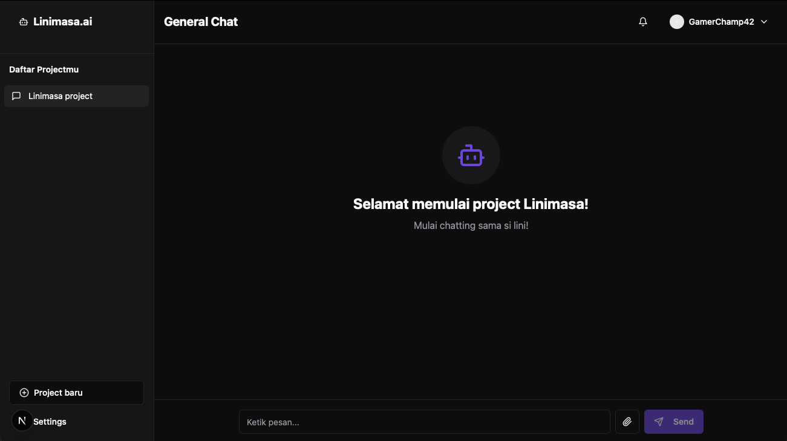

# 🚀 Linimasa.AI

<div align="center">
  
  
  
</div>


[](https://opensource.org/licenses/MIT)

Linimasa.AI adalah solusi manajemen proyek berbasis AI yang revolusioner, dirancang khusus untuk pasar Indonesia. Dengan memanfaatkan kekuatan AI, Linimasa.AI memungkinkan Anda membuat timeline proyek yang detail dan terstruktur hanya dengan mengetikkan prompt sederhana.

## ✨ Fitur Utama

- 🤖 **Generasi Timeline Otomatis** - Cukup jelaskan proyek Anda, AI kami akan menghasilkan timeline yang komprehensif
- 🎯 **Optimasi Proyek** - Analisis cerdas untuk alokasi sumber daya dan estimasi waktu yang lebih akurat
- 🌐 **Konteks Lokal** - Disesuaikan dengan cara kerja dan budaya bisnis Indonesia
- 📊 **Visualisasi Interaktif** - Tampilan Gantt chart dan timeline yang mudah dipahami
- 👥 **Kolaborasi Tim** - Fitur berbagi dan kolaborasi real-time

## 🚀 Memulai
```sh
make run
```